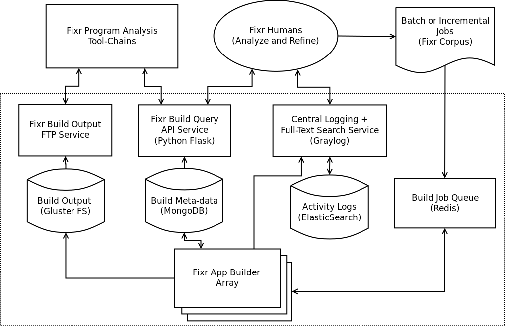

# FixrAppBuilderFarm

## What is this GitHub Project?

Its our Full-Stack Cloud Service for the Fixr App Builder script. Before the technical blah blah blahs, lets 
take a look at a diagram that describes what it is:

This prototype system is our current attempt to scale up our Android app building operations. It is currently
a grease monkey jerry-rigged monstrosity, but hopefully in time, it will be polished and robust enough to be
extended to encompose other critical operations of the Fixr pipeline. But before we drift off to paradise, with
the magic unicorn, lets return to reality and the status quo: here's a brief lo-down on the Fixr App Builder Farm
pipeline:

* Batch/Incremental Jobs: The pipeline starts with a list of jobs, each representing a specific commit of a Android
application in a GitHub repository that we wish to be built. Jobs are uniquely identified by the triplet, user name
repository name and commit hash. Currently, the only way we invoke the pipeline, is by pushing the list of commit history
extracted from our Muse tool (https://github.com/kenbod/muse). Particularly, the latest and greatest copy of the
history.json file. Included in this project, is a simple Python script (details below) that converts entries of the
history.json file into jobs recognized by our Fixr App Builders. In future, we intend to feed incremental jobs from
active focused crawl data extracted from GitHub on a daily basis, but thats a story for another time.

* Redis Job Queue: Jobs for the App Builders are stored in Redis (http://redis.io/). It provide us semi-persistent
storage of job data and the ability to manage the scheduling of jobs to the app builder array. Current means to 
manipulate the job queue is basic (simple scripts to redis shell command line), but future plans will include implementing
an interactive job queue manager.

* Fixr App Buider Array: The main workhorses of this pipeline. This comprises of a cluster of computing nodes (currently 
OpenStack VMs) that does the actual building of Android apps. The key features of this pipeline is centralized storage of
build output, meta-data and logging information (Current deployment has no redundancies and fault tolerence, but can be
scaled up thanks to the technologies we are using). Build output (.jars, .classes and .apks) are stored in a file-system. 
It is shown as GFS in the diagram, but currently it is loaded in a local Cinder volume (due to OpenStack/GFS instability).
Meta-data of the build (build outcome, paths, apps, etc..) are stored in MongoDB, while build logs are stored in GrayLog
centralized logger, which has Elastic search as a backend.

* Builder Web Services: There is currently one main web service that is provide, the Fixr Build Query API service. It
provides a query interface intended for other Fixr tools to extract build information. In conjunction, we intend to 
implement a simple FTP service to allow Fixr tools to retrieve build outputs (Currently not deployed, but can easily
be done when need arises). 

## Current Deployment Layout

The current deployoment layout is... well, bad. In an ideal world, each box (as well as cylinder) in the above diagram 
would correspond to an OpenStack VM. But due to limited resources and compounded by the instability of our OpenStack
cluster, the Fixr App Builder is currently deployed as follows on the following VMs:

* Fixr-App-Buider-Beta (192.12.242.242) in Muse Project: Running Redis Job Queue, MongoDB with build meta-data,
  attached with Cinder volume containing build outputs and running build query service. Also has x2 builder threads
  running.

* Loggermon-Alpha (192.12.242.231) in PL Project: Running the GrayLog centralized logger and x2 builder threads

* fixr_clustering_new (192.12.243.136) in PL Project: Running x2 builder threads

## Dependencies and Install/Deployment instructions

Deployment of the Fixr App Builder Farm is currently a rather involved process. Why shouldn't it be? Since it
comprises of several sub-components that are designed to span across multiple VMs. So before we have the time to upgrade this
with fancy Docker containers and elastic cloud integration, we've got this readme file and you, a capable and young(ish) Fixr 
human subject, to drive this wonderful process. We list the dependencies and deployment instructions organsized by
logical sub-components of this tool-chain. This project is mainly developed in Python, so the only stuff you'll
need to install are libraries. Note that with default port settings, it is possible to run this entire tool chain on a single 
VM/PC.

### Before you start

Get you favorite package management and auxiliary dev/support tools (e.g., apt-get, easy_install, pip, wget, make). 
This project was tested and deployed on Ubuntu 14.04 and 16.04, so if you have not noticed, instructions here
will be obviously Ubuntu-centric. But you are a capable and adaptable young person, you'll easily figure out
the equivalent tools on your favorite OS.

Also, note that in the following, we will report the default network ports in which the subcomponent uses. This can
of course be modified, but most importantly for web access of these sub-systems, the VM's security group must include
open ingres rules for these network ports. 

### Build Job Queue

Dependencies: Redis 3.2.3, Python 2.7, redis-py 2.10.5

- Install Redis as instructed at http://redis.io/download 
- apt-get Python 2.7 and easy_install (or pip) redis-py

At this point, you should be able to start a redis server and interact with it through Python shell.
See http://redis.io/documentation and https://pypi.python.org/pypi/redis for instructions on how to
use Redis and its Python bindings.

You should start Redis with basic password authentication, run the following in a screen:

> redis-server --requirepass (password)

The alternative is to create a Redis configuration file with this password requirement, and/or run redis server as an OS service.
Note that Redis' default port used is 6379.

### MongoDB Build Meta-Data Store

Dependencies: MongoDB 3.0.4, PyMongo 3.3.0

- apt-get mongodb and easy_install/pip pymongo .

You should configure MongoDB to (1) store its data in an appropriate volume and (2) Require authorized access.
To do this, modify the conf file, normally found in /etc/mongod.conf and restart the mongoDB server. You will
also need to create a MongoDB user which the Fixr App Builders can authenticate as (See https://docs.mongodb.com/manual/).
Default network port for MongoDB is 27017.

### GrayLog Central Logging Service

Dependencies: GrayLog 2.1.0, Java (>=8), MongoDB (>=2.4), ElasticSearch (>=2.x)

- Install the appropriate versions of Java, MongoDB and ElasticSearch (See http://docs.graylog.org/en/2.1/pages/installation/os/ubuntu.html)
- apt-get graylog-server (See http://docs.graylog.org/en/2.1/pages/installation/operating_system_packages.html)

Following the instructions in the GrayLog website, they are pretty complete. Once you have setup the server, you should be
able to enter the console, if you have expose the appropriate ports on your VM (default 9000).

### Fixr Build Query Service

Dependencies: Flask 0.11, MongoDB 3.0.4, PyMongo 3.3.0, Redis 3.2.3, Python 2.7, redis-py 2.10.5

- Install Redis and MongoDB dependencies, including Python libraries.
- Install Python Flask (See http://flask.pocoo.org/)
- Install Python modules pytz and graypy

At this point, you should be able to start the app builder query service. But before that, make sure your configuration file 
app_builder.ini is configured correctly (See .ini configurations below). Once configurations are done, run the following Python 
Flask script in the flaskService folder:

> python query_service.py

You can do this either on bare-metal on a screen (if you are ok getting hacked eventually), or behing your favorite web server (Apache, Ngix, etc..)
Default port is 8080.

### Fixr App Builder Service

Dependencies: MongoDB 3.0.4, PyMongo 3.3.0, Redis 3.2.3, Python 2.7, redis-py 2.10.5, Java (>=8), Android SDKs/NDK (platform tools/tools and ALL sdks), 
Gradle (primary 2.14.1, plus ALL other versions)

### .ini Configurations

Our Python server scripts in this project fetches configuration parameters from a default .ini file, app_builder.ini . The two main
Python server scripts are builder_services.py and query_services.py, both found in the folder flaskService.
These configurations are divided into several categories:

* dbOptions: MongoDB options. Here, we indicate the host name (host) and network port (port) of the MongoDB server storing 
Build Meta-data, as well as the appropriate username (user) and password (pwd). You should also indicate the name of the
MongoDB database (name).

* qServeOptions: Fixr App Builder Query service options. Here, we indicate the host name (host) and network port (port) that
the query service should use. Also include an optional name parameter as a name identifier for the centralized logs.

* redisOptions: Redis server options. Here, we indicate the host name (host) and network port (port) of the Redis
server that runs the Build Job Queue. We should also indicate the password to be used (pwd) and two entry points of
the Redis: 'jobs' indicates the name of the main job queue, while 'failed' indicates the name of the queue containing failed
jobs.

* buildOptions: Fixr App Builder service options. Here, we indicate the main working folder of the builder (workdir) and
whether or not its contains are to be removed after processing (removework). We also indicate the name of the builder (name)
and two other important configuration parameters: 'archivehost' and 'archivedir' indicates the host name and local path of
where build outputs are stored, while 'gradlefarmpath' indicates the local path where local gradle binaries (various versions) 
are stored.

* logOptions: Logging option to be used. 'logtype' indicate the type of logging to use. Currently supports graylog (default)
and filelog. For Graylog, you must specify the host name and port of the GrayLog service used, while standard file log
requires the 'filename'.

